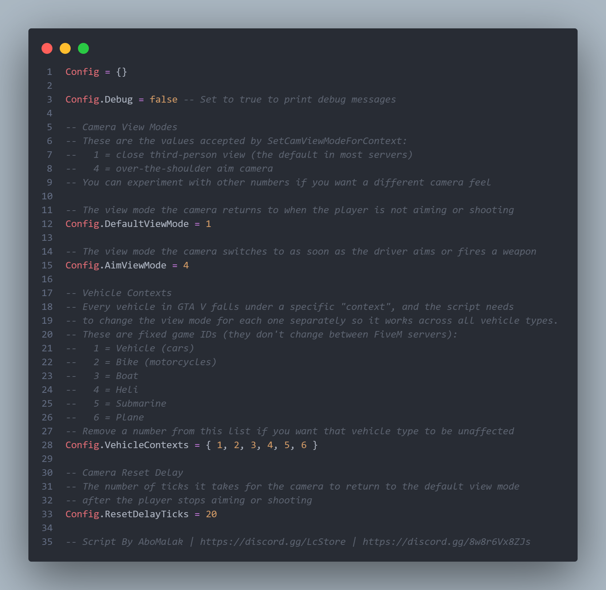

# 🎯 Lc-firstaim for FiveM

Enhance your FiveM experience with **Lc-firstaim**! 🚀  

---

## 🌟 Features
- ⚙️ Fully customizable system via `config.lua`
- 🧠 Optimized using **ox_lib threads**
- 🚗 Automatically activates for drivers
- 🔄 Synced behavior between all players
- 💨 Lightweight & performance-friendly
- 🌐 Works with **QB-Core, ESX, or Standalone setups**

---

## 📦 Installation & Setup
1. Download or clone this repository.  
2. Place the folder in your `resources` directory and rename it to `Lc-firstaim`.  
3. Add the following lines to your **server.cfg**:
    ```bash
    ensure ox_lib
    ensure Lc-firstaim
    ```
4. Adjust the settings in your `config.lua` file.  
5. Restart your server and enjoy! 🎮

---

## 💻 Requirements
- ⚙️ [ox_lib](https://github.com/overextended/ox_lib)  

> 🧩 **Mandatory:** Requires **ox_lib** to function.

---

## ⚙️ Configuration Example (`config.lua`)



---

## 📝 Changelog
- v1.0.0: Initial release

---

## 📝 License

This project is released under the [MIT License](https://opensource.org/licenses/MIT).